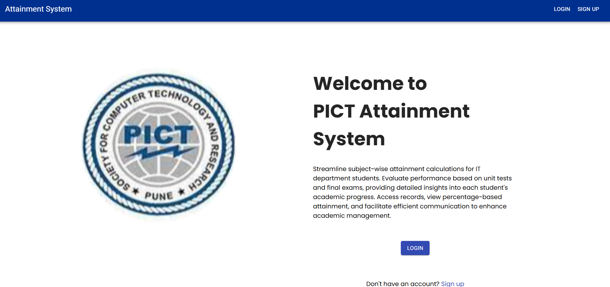
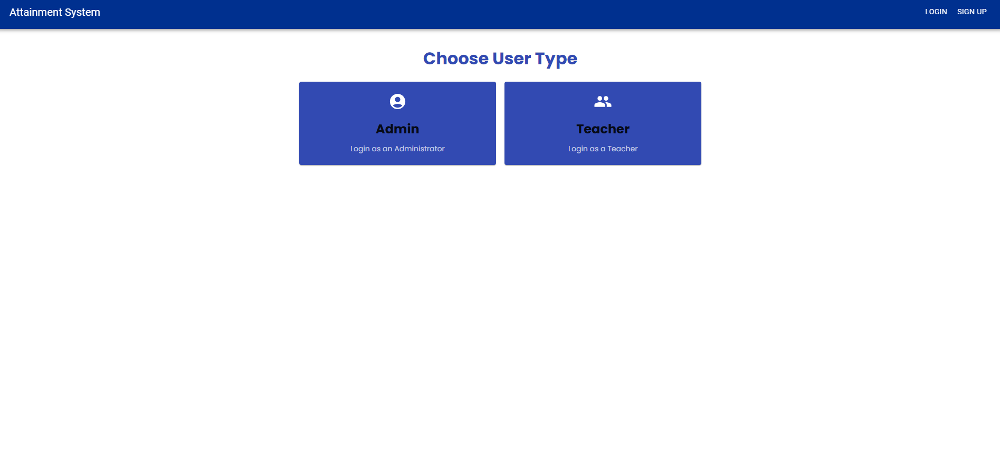
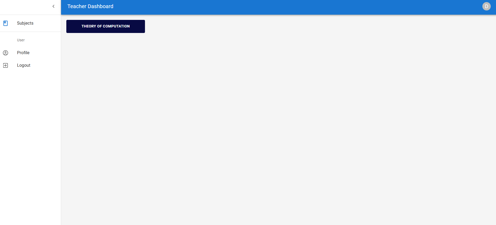
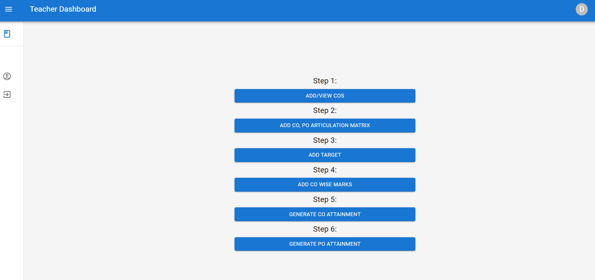
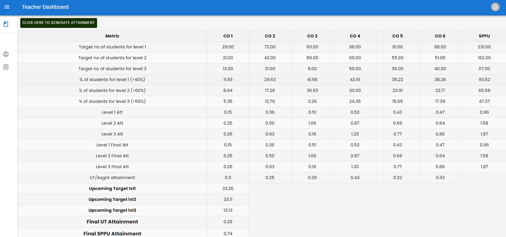
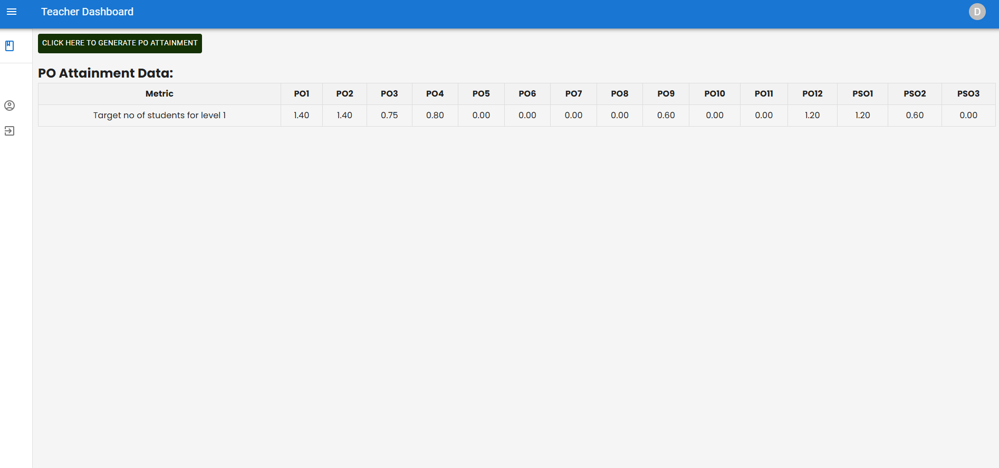
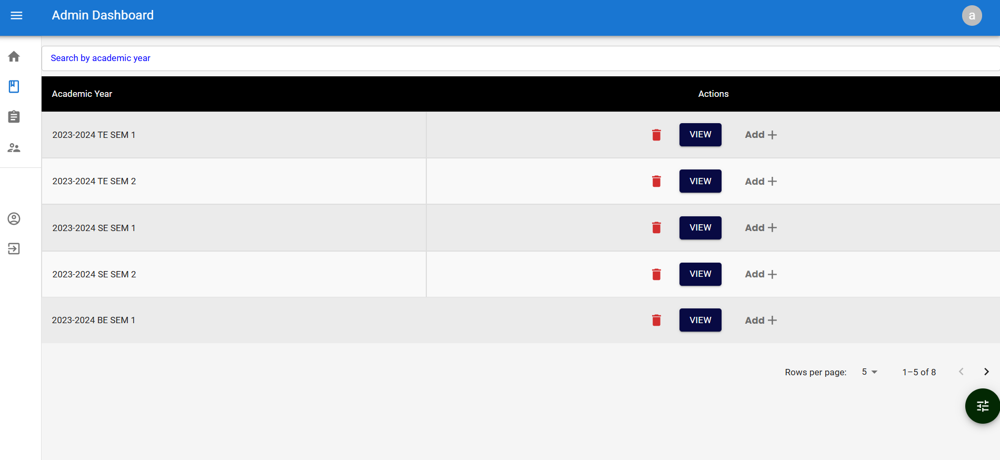
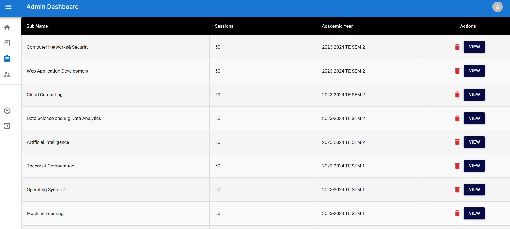
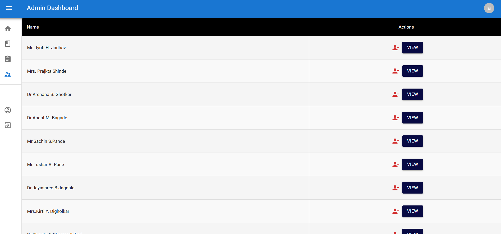
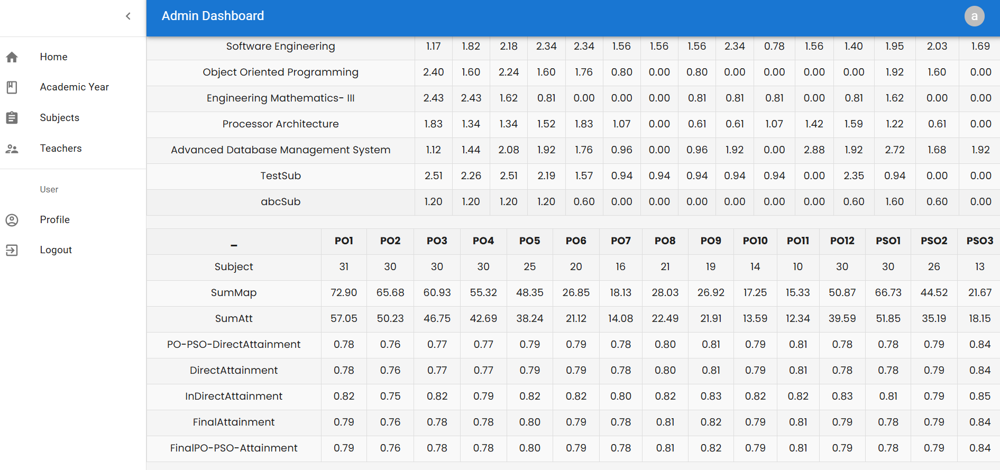

 

    
  </a>

  <h3 align="center">CO-PO Attainment Calculation System</h3>

  

   A Comprehensive Software Solution that automates the calculation of Course Outcomes (COs) 
     and Program Outcomes (POs) attainment within Academic departments.
     
<!--     <a href=""><strong> Explore Project Documentation »</strong></a> -->
<!--       -->
     
    <a href="https://drive.google.com/drive/folders/1UrTzAdQ5HGu_PES7qj9sW8ximYtwvfKs?usp=drive_link">Watch Insights »</a>

  

<!-- ABOUT THE PROJECT -->
 

## About The Project

### Project Overview: Attainment System 

* The Attainment Calculation System is a comprehensive software solution designed to streamline and automate the process of calculating course outcomes (COs) and program outcomes
(POs) attainment within academic departments.

* The system facilitates collaboration between administrators and faculty members, providing tools for efficient data management, analysis, and reporting.

* Administrators have access to academic year details, subject information, and faculty assignments, enabling them to assign subjects to faculty members and monitor academic
progress.

* Faculty members utilize individual subject interfaces to perform various actions, including adding or editing Course Outcomes, uploading articulation matrices, and calculating
CO and PO attainment.

* The system supports the uploading of unit test and end semester marks, facilitating data-driven decision-making.

* Upon completion of steps, final PO attainment and articulation matrix column averages are displayed for administrator review and Attainment Calculation System empowers administrators to calculate the final attainment based on all subjects of the department, consolidating data from individual subjects.
 
 

## Screenshots

 

<em>Home Screen</em>

 

<em>Role Based Access</em>

 

   
 

<em>List of allotted subjects (faculty login)</em>

 

   

<em>Attainment generation steps</em>

 

  

<em>Automated CO Attainment Data Generation for Individual Subject</em>

 

 

<em>Automated PO Attainment Data Generation for Individual Subject</em>

 

  

<em>Academic year (admin login)</em>

 

  
 

<em>Subject list</em>

 

  
 

<em>Faculty list</em>

 

  

<em>Final Attainment Data Generated for the Department</em>

 

  
  

## TechStack
 

* [![React][React.js]][React-url]
* [![Materialui][materialui.com]][materialui-url]
* [![Node][Node.js]][Node-url]
* [![Express][Express.js]][Express-url]
* [![MongoDb][MongoDb.com]][MongoDb-url]

## Deployment
 

* [![vercel][vercel.com]][vercel-url]
* [![render][render.com]][render-url]

<!-- GETTING STARTED -->

(<a href="#readme-top">back to top</a>)

<!-- https://www.markdownguide.org/basic-syntax/#reference-style-links -->
[contributors-shield]: https://img.shields.io/github/contributors/othneildrew/Best-README-Template.svg?style=for-the-badge
[contributors-url]: https://github.com/othneildrew/Best-README-Template/graphs/contributors
[forks-shield]: https://img.shields.io/github/forks/othneildrew/Best-README-Template.svg?style=for-the-badge
[forks-url]: https://github.com/othneildrew/Best-README-Template/network/members
[stars-shield]: https://img.shields.io/github/stars/othneildrew/Best-README-Template.svg?style=for-the-badge
[stars-url]: https://github.com/othneildrew/Best-README-Template/stargazers
[issues-shield]: https://img.shields.io/github/issues/othneildrew/Best-README-Template.svg?style=for-the-badge
[issues-url]: https://github.com/othneildrew/Best-README-Template/issues
[license-shield]: https://img.shields.io/github/license/othneildrew/Best-README-Template.svg?style=for-the-badge
[license-url]: https://github.com/othneildrew/Best-README-Template/blob/master/LICENSE.txt
[linkedin-shield]: https://img.shields.io/badge/-LinkedIn-black.svg?style=for-the-badge&logo=linkedin&colorB=555
[linkedin-url]: https://linkedin.com/in/othneildrew
[product-screenshot]: images/screenshot.png
[Next.js]: https://img.shields.io/badge/next.js-000000?style=for-the-badge&logo=nextdotjs&logoColor=white
[Next-url]: https://nextjs.org/
[React.js]: https://img.shields.io/badge/React-20232A?style=for-the-badge&logo=react&logoColor=61DAFB
[React-url]: https://reactjs.org/
[Vue.js]: https://img.shields.io/badge/Vue.js-35495E?style=for-the-badge&logo=vuedotjs&logoColor=4FC08D
[Vue-url]: https://vuejs.org/
[Angular.io]: https://img.shields.io/badge/Angular-DD0031?style=for-the-badge&logo=angular&logoColor=white
[Angular-url]: https://angular.io/
[Svelte.dev]: https://img.shields.io/badge/Svelte-4A4A55?style=for-the-badge&logo=svelte&logoColor=FF3E00
[Svelte-url]: https://svelte.dev/
[Laravel.com]: https://img.shields.io/badge/Laravel-FF2D20?style=for-the-badge&logo=laravel&logoColor=white
[Laravel-url]: https://laravel.com
[Bootstrap.com]: https://img.shields.io/badge/Bootstrap-563D7C?style=for-the-badge&logo=bootstrap&logoColor=white
[Bootstrap-url]: https://getbootstrap.com
[JQuery.com]: https://img.shields.io/badge/jQuery-0769AD?style=for-the-badge&logo=jquery&logoColor=white
[JQuery-url]: https://jquery.com 
[Node.js]: https://img.shields.io/badge/Node.js-43853D?style=for-the-badge&logo=node.js&logoColor=white
[Node-url]: https://nodejs.org/en
[Express.js]: https://img.shields.io/badge/Express%20js-000000?style=for-the-badge&logo=express&logoColor=white
[Express-url]: https://expressjs.com/
[Firebase.js]: https://img.shields.io/badge/firebase-%23039BE5.svg?style=for-the-badge&logo=firebase
[Firebase-url]: https://firebase.google.com/
[tailwindcss.com]: https://img.shields.io/badge/tailwindcss-0F172A?style=for-the-badge&logo=tailwindcss
[tailwindcss-url]: https://tailwindcss.com/
[MongoDb.com]: https://img.shields.io/badge/-MongoDB-13aa52?style=for-the-badge&logo=mongodb&logoColor=white
[MongoDb-url]: https://www.mongodb.com/
[Flask.com]: https://img.shields.io/badge/Flask-000000?style=for-the-badge&logo=flask&logoColor=white
[Flask-url]: https://flask.palletsprojects.com/en/3.0.x/
[razorpay-url]: https://razorpay.com/
[razorpay.com]: https://img.shields.io/badge/Razorpay-02042B?style=for-the-badge&logo=razorpay&logoColor=3395FF
[zoom-url]: https://zoom.us/
[zoom.com]: https://img.shields.io/badge/Zoom-2D8CFF?style=for-the-badge&logo=zoom&logoColor=white 
[cloudinary.com]: https://img.shields.io/badge/-Cloudinary-3448C5?style=for-the-badge&logo=cloudinary&logoColor=white
[ultramsg.com]: https://img.shields.io/badge/-ultramsg-13aa52?style=for-the-badge&logo=ultramsg&logoColor=white
[email.js]: https://img.shields.io/badge/-emailjs-FFA116?style=for-the-badge&Color=white
[weglot.com]: https://img.shields.io/badge/weglot-00599C?style=for-the-badge
[twilio.com]: https://img.shields.io/badge/Twilio-F22F46?style=for-the-badge&logo=Twilio&logoColor=white
[materialui.com]: https://img.shields.io/badge/Material%20UI-007FFF?style=for-the-badge&logo=mui&logoColor=white
[materialui-url]: https://mui.com/material-ui/material-icons/
[vercel.com]: https://img.shields.io/badge/Vercel-000000?style=for-the-badge&logo=vercel&logoColor=white
[vercel-url]: https://vercel.com/
[render.com]: https://img.shields.io/badge/render-000000?style=for-the-badge&logo=render&logoColor=white
[render-url]: https://render.com/

